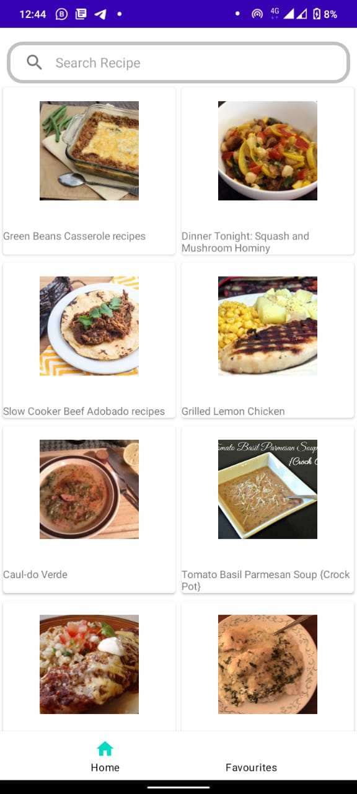
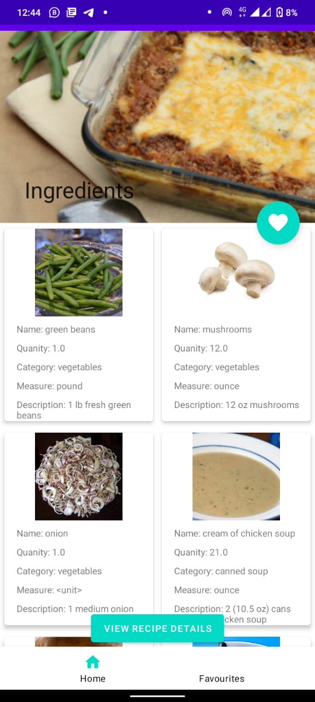

# README!!
The api used has a limit request hence if many requests are made it stops making request for a period of time
### The App
Recipe android application is an android app that allow you to search for your favourite meals and provide you with ingredients along with the process to make the meal. I used the Edamam food database endpoint api to retrieve the meals. The endpoint is free and can be customized to your liking. 

Endpoint: https://developer.edamam.com/edamam-docs-recipe-api#/


### Example Response 
```json
{
  "from": 0,
  "to": 0,
  "count": 0,
  "_links": {
    "self": {
      "href": "string",
      "title": "string"
    },
    "next": {
      "href": "string",
      "title": "string"
    }
  },
  "hits": [
    {
      "recipe": {
        "uri": "string",
        "label": "string",
        "image": "string",
        "images": {
          "THUMBNAIL": {
            "url": "string",
            "width": 0,
            "height": 0
          },
          "SMALL": {
            "url": "string",
            "width": 0,
            "height": 0
          },
          "REGULAR": {
            "url": "string",
            "width": 0,
            "height": 0
          },
          "LARGE": {
            "url": "string",
            "width": 0,
            "height": 0
          }
        },
        "source": "string",
        "url": "string",
        "shareAs": "string",
        "yield": 0,
        "dietLabels": [
          "string"
        ],
        "healthLabels": [
          "string"
        ],
        "cautions": [
          "string"
        ],
        "ingredientLines": [
          "string"
        ],
        "ingredients": [
          {
            "text": "string",
            "quantity": 0,
            "measure": "string",
            "food": "string",
            "weight": 0,
            "foodId": "string"
          }
        ],
        "calories": 0,
        "glycemicIndex": 0,
        "totalCO2Emissions": 0,
        "co2EmissionsClass": "A+",
        "totalWeight": 0,
        "cuisineType": [
          "string"
        ],
        "mealType": [
          "string"
        ],
        "dishType": [
          "string"
        ],
        "instructions": [
          "string"
        ],
        "tags": [
          "string"
        ],
        "externalId": "string",
        "totalNutrients": {},
        "totalDaily": {},
        "digest": [
          {
            "label": "string",
            "tag": "string",
            "schemaOrgTag": "string",
            "total": 0,
            "hasRDI": true,
            "daily": 0,
            "unit": "string",
            "sub": {}
          }
        ]
      },
      "_links": {
        "self": {
          "href": "string",
          "title": "string"
        },
        "next": {
          "href": "string",
          "title": "string"
        }
      }
    }
  ]
}
```
### Architecture and libraries
The app is simple and uses the MVVM architecture. Libraries used in the app include
- Room library for storing liked meals
- Retrofit for retrieving endpoint data
- Live data
- View Model
- Data binding

### App Demo
https://user-images.githubusercontent.com/74680234/233775333-080c8bec-aa19-4e17-8ec4-1441eed1e7a8.mp4
### App images
 

